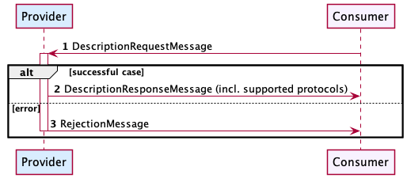
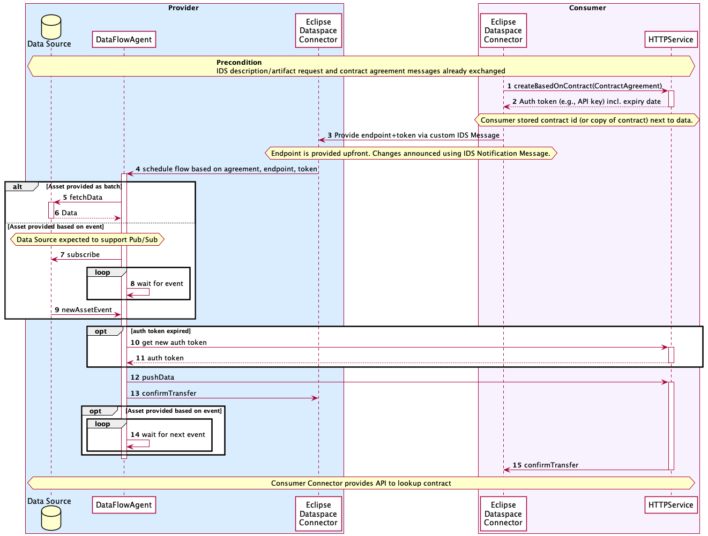

# Data Flows Supported by the EDC

|   |Push Provider initiates the data flow|Pull Consumer initiates the data flow|
|---|---|---|
|HTTP/REST|API on Consumer side|API on provider side|
|Stream|Provider streams data to messaging Destination on consumer side|Consumer connects to a Destination on provider side|
|S3|Provider pushes data to destination bucket on consumer side|Consumer pulls data from a bucket on provider side|

## Preliminary IDS Messages

In case IDS is used as protocol, supported data flow types can be part of the data and contract offers:

Description:
- Provider lists supported protocols and flows (e.g., HTTP push) as part of the initial contract offer. TBD which IDS message property can be used.

Subsequently, a contract negotiation (not depicted here) is performed.

## HTTP Push

Description:
- The DataFlowAgent fetches data from a data source, which can either be a storage (e.g., database) or a service (e.g. an app performing transformations).
- The DataFlowAgent is not responsible for data transformation (e.g., anonymization). Instead, a data service performing this task and acting as proxy should be assigned this task.
- The consumer creates an auth token (maybe just valid for a limited time range) that gets passed to the provider and can be used to identify the contract. An alternative can be to use the a DAT token + a contract reference in every call.
- The consumer stores the contract id (or copy of contract) next to the data.
- The consumer connector provides an API to lookup contracts.
- The HTTPService either creates a separate endpoint for each transaction, or uses the same endpoint each time and assures an isolated storage of the received assets.
## HTTP Pull
TBD

## Stream Push
TBD

## Stream Pull
TBD

## S3 Push
TBD

## S3 Pull
TBD
## Open Issues:
- Info Model need to be extended to support specifying/distinguishing between existing asset and subscriptions (incl. time frame and frequency)