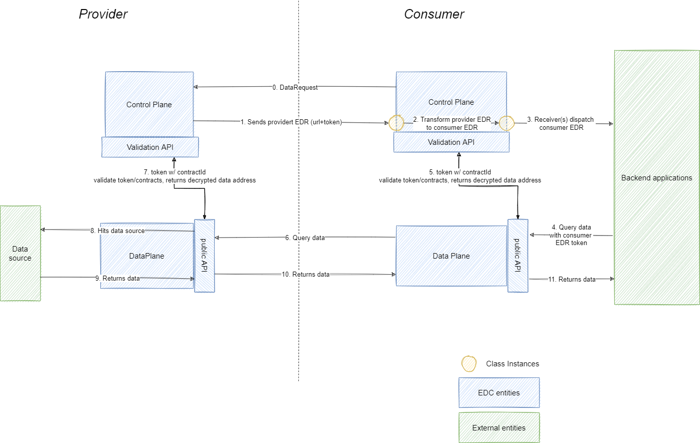

# Data Plane Transfer Sync

This extension provides resources in order to perform Client Pull data transfer using the Data Plane as a data proxy.
Its main goal is to generate/validate the access tokens that will later be used by the consumer for querying data through
the Data Plane public API.

## Background

The typical use-case behind this extension is when the provider data source is a REST API (can be something, tough). Here
the data consumer might want to query multiple times the provider data API without having to negotiate again a contract for each
data query, as it would overload the Control Plane which is in charge of the negotiation process.

Instead, this extension offers support to request once the access to the data, and then use the Data Plane as a data proxy
for querying the data as long as the contract agreed between the two parties is still valid.

### Scope

This extension is dedicated to use-cases wherein the consumer wants to actively pull data from the provider, potentially
multiple times and with a different set of parameters, e.g. query parameters, request body...

### Use Cases

Let us consider that a data provider wants to expose a REST API serving flight schedule data. This REST API takes in input
a set of query parameters which enables to restrict the set of data that are returned in output, e.g. departure date, boarding airport...
A consumer of this API will potentially be interested in hitting this API several times, potentially with different parameters, depending
on how the consumer backend application are using the data.

For this use-case, Provider Push data transfer are not relevant, as they would require to establish a new contract for each data query,
thus overloading the Control Plane. This is a typical use-case for which the present extension should be preferred.

## Technical Details

### Interfaces

This extension exposes an endpoint queried by the Data Plane in order to validate the access token.
OpenApi documentation can be found [here](../../../../resources/openapi/yaml/data-plane-transfer-sync.yaml).

### Dependencies

| Name                                        | Description                             |
|:--------------------------------------------|:----------------------------------------|
| extensions:data-plane-selector:selector-spi | Required for `DataPlaneSelectorService` |

### Configurations

| Parameter name                                      | Description                                                                                                                        | Mandatory | Default value                          |
|:----------------------------------------------------|:-----------------------------------------------------------------------------------------------------------------------------------|:----------|:---------------------------------------|
| `edc.transfer.proxy.token.signer.privatekey.alias`  | Alias of private key used to sign token used to hit Data Plane public API                                                          | true      |                                        |
| `edc.transfer.proxy.token.verifier.publickey.alias` | Alias of public key used to verify tokens hitting the Data Plane public API (public key must be in the Vault)                      | false     | private key alias suffixed with "-pub" |
| `edc.transfer.proxy.token.validity.seconds`         | Validity of tokens generated for hitting Data Plane public API (in seconds)                                                        | false     | 600                                    | 
| `edc.transfer.client.selector.strategy`             | Selection strategy used by the client to determine to which Data Plane instance data transfer should be delegated                  | false     | random                                 |

## Terminology

## Design Principles

As mentioned earlier, the goal of this extension if to generate and validate the token used in input of the Data Plane public API.
Hereafter we detail the different steps.

### Token construction and dispatch

The token is first created on provider side within `ProviderDataPlaneProxyDataFlowController`, which is triggered for every data request
having _HttpProxy_ as destination type. This data flow controller encrypts the content address and builds a signed token
containing this encrypted address as claim along with the contract id. This token is wrapped into an `EndpointDataReference` (EDR) object along with the
URL of Data Plane to be used as proxy for querying the data. The Data Plane instance to be used is determined through the `DataPlaneSelectorService`.
If the extension is provided in a runtime with an embedded Data Plane and it exposes the `public` API, the embedded Data Plane will be used as proxy.

> **_NOTE:_**  For a Data Plane instance to be eligible for the transfer, it must:
>  - contains `HttpProxy` in the `allowedDestTypes`
>  - contain a `property` which key `publicApiUrl`, which contains the actual URL of the Data Plane public API.

This provider EDR is then sent to the consumer Control Plane which will wrap it into a data address with type `HttpData`,
and generate a _consumer_ EDR whose target URL will this time be the **consumer** DPF public API.
The consumer Control Plane will also generate a signed token having as claims:

- the contract id which is the same as the one present in the EDR generated by the provider Control Plane,
- the EDR generated by the provider Control Plane wrapped as a `HttpData` data address and formatted as an encrypted string.

This step of converting the _provider_ `EndpointDataReference` into a _consumer_ `EndpointDataReference` is performed by
the `DataPlaneProxyManager`.

At the end of this process, the consumer _EDR_ that is then dispatched to the consumer backend application contains a URL
targeting the public API of the consumer DPF, and a bearer token signed by the consumer Control Plane and containing as
claims:

- the contract id,
- a data address with type `HttpData` representing the EDR generated by the provider and containing:
    - a URL to the provider DPF public API,
    - a bearer token signed by the provider Control Plane, which contains as claims the address of the actual data
      source.

As both provider and consumer Control Planes have both signed the final token, it is required to pass through both the Data Planes of
the consumer and the provider.

### Token validation

When Data Plane public API is hit, it will first validate the input token. This is achieved by targeting the validation API
exposed by the present extension. This validation consists in:

- checking token signature, i.e. verify it has been signed by the Control Plane.
- asserting that the token is still valid and that the Contract still allows access to the data.

If both conditions are satisfied then the data address from the claims is decrypted and returned to the Data Plane which
will then be able to perform the data transfer.

#### Flow diagram

.

## Decisions
