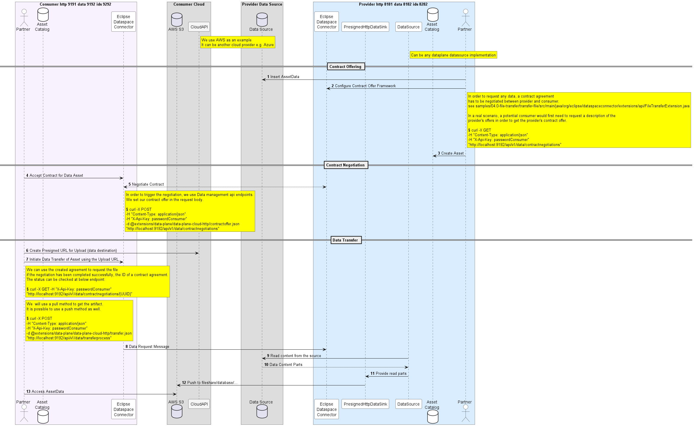

# Data Plane Cloud HTTP extension

This extension provides support for sending data sourced from an HTTP endpoint and putting data to a cloud presigned url based HTTP endpoint when working with 
small files (< 50MB) and the cloud access is wrapped (therefore no direct access to the cloud API). By
nature of the DPF design, which supports _n_-way transfers, HTTP-sourced data can be sent to any `DataSink` type and an
HTTP endpoint can receive data from any `DataSource` type. The extension is designed to stream the full content at once since there is a single upload url 
and the expectation from cloud API perspective it that the full data gets pushed at once; this adds memory pressure for big files therefore it is recommended to 
use this extension for small files. It is possible to bypass this limitation by registering a resource definition multiple times, each one handling a single upload presigned url for a 
single part - note that the multiplart request need to be done first and the multipart id used for the later provisioners - see [Official AWS Doc](https://docs.aws.amazon.com/AmazonS3/latest/userguide/mpuoverview.html) and [Boto example](https://dev.to/traindex/multipart-upload-for-large-files-using-pre-signed-urls-aws-4hg4).

Note that Azure Object Storage or S3 extensions should be preferred to the current extensions when performing large data
transfers as it supports more scalable parallelization; note that they require the cloud credentials to be at hand.

